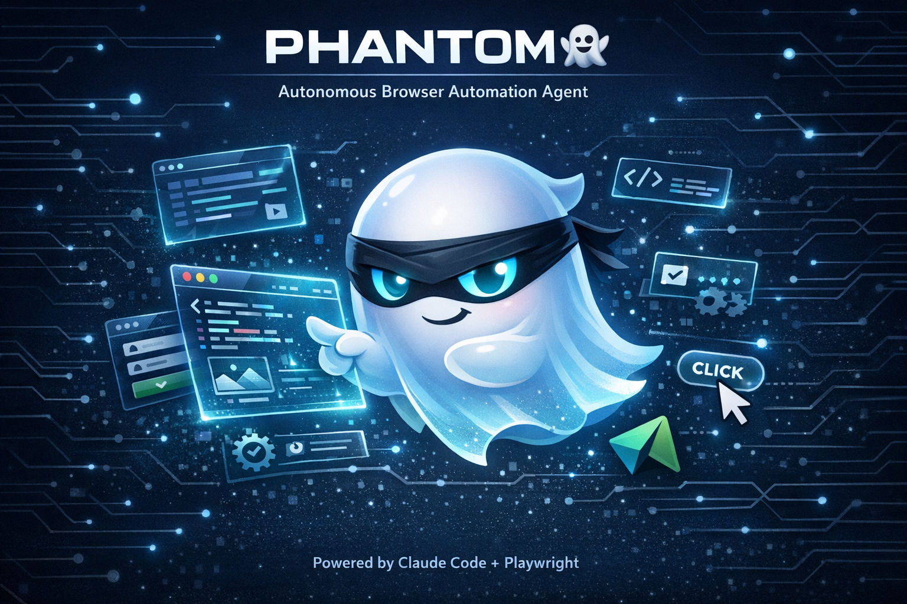

# Phantom 👻

**An autonomous browser automation agent powered by Claude Code and Playwright.**

Phantom is a browser automation agent that receives tasks via Slack, executes them in a real browser using Playwright, and reports results back. It uses Claude Code as its brain (planning, reasoning, decision-making) and a Playwright-based toolkit as its hands and eyes.

## 🏗️ Architecture

```
┌─────────────────────────────────────────────────────────────────────┐
│                       ORCHESTRATOR                                  │
│                    (orchestrator.py)                                 │
│                                                                     │
│   Launches Claude Code with PHANTOM_SPEC.md as the system prompt    │
│   Runs work + monitor processes in parallel                         │
└──────────────────────────────┬──────────────────────────────────────┘
                               │
                               ▼
┌─────────────────────────────────────────────────────────────────────┐
│                      CLAUDE CODE (Brain)                            │
│                                                                     │
│   Reads PHANTOM_SPEC.md → plans actions → calls toolkit             │
│   Decides what to observe, click, type, navigate                    │
└──────────────────────────────┬──────────────────────────────────────┘
                               │
                               ▼
┌─────────────────────────────────────────────────────────────────────┐
│                     PHANTOM TOOLKIT                                  │
│                                                                     │
│   ┌──────────────┐  ┌──────────────┐  ┌──────────────────────┐     │
│   │   Observer    │  │   Actions    │  │  Browser Server      │     │
│   │  (the eyes)  │  │  (the hands) │  │  (persistent Chrome) │     │
│   └──────────────┘  └──────────────┘  └──────────────────────┘     │
│                                                                     │
│   ┌──────────────┐  ┌──────────────┐  ┌──────────────────────┐     │
│   │     VNC      │  │   Presets    │  │      Config          │     │
│   │ (human help) │  │ (templates)  │  │   (settings)         │     │
│   └──────────────┘  └──────────────┘  └──────────────────────┘     │
└─────────────────────────────────────────────────────────────────────┘
                               │
                               ▼
┌─────────────────────────────────────────────────────────────────────┐
│                     COMMUNICATION                                    │
│                                                                     │
│   ┌──────────────────┐  ┌──────────────────────────────────────┐   │
│   │  Slack Interface  │  │  Memory (persistent context)         │   │
│   │  (input/output)   │  │  memory/phantom_memory.md            │   │
│   └──────────────────┘  └──────────────────────────────────────┘   │
└─────────────────────────────────────────────────────────────────────┘
```

### Key Design Decisions

- **Persistent Browser**: Chromium runs as a background server on port 9222. Tasks connect via CDP — tabs, cookies, and state survive across tasks.
- **Claude Code as Brain**: No hardcoded agent loop. Claude Code reads the spec, plans, and calls observer/actions directly.
- **Dual-Process Architecture**: The orchestrator runs two parallel processes — a **Work** process (initialization only, no Slack access) and a **Monitor** process (exclusive Slack listener). Only the Monitor polls Slack for mentions. An anti-duplicate guard (`PHANTOM_BATCH_MODE`) limits messages per thread to prevent double-responses.
- **Self-Healing Selectors**: Actions module tries multiple selector strategies (ID, text, aria, CSS) and falls back automatically.
- **Set-of-Mark (SoM) Labels**: Observer overlays numbered labels on interactive elements for reliable element targeting.

## 📁 Project Structure

```
browser-automation/
├── README.md
├── requirements.txt
├── orchestrator.py              # Main orchestrator — launches Claude Code
├── monitor.py                   # Slack message monitor (runs in parallel)
├── slack_interface.py           # Slack communication CLI tool
├── browser_interface.py         # Playwright browser wrapper (CDP + ephemeral)
├── agents_config.py             # Agent configuration (Phantom)
├── claude-wrapper.sh            # Claude Code launcher with retry logic
├── settings.json                # LiteLLM gateway settings
├── tavily_client.py             # Web search client
│
├── phantom/                     # Browser automation toolkit
│   ├── observer.py              # Page observer — screenshots + accessibility tree
│   ├── actions.py               # Action executor — click, type, navigate, etc.
│   ├── browser_server.py        # Persistent Chromium server (port 9222)
│   ├── config.py                # Configuration (viewport, timeouts, paths)
│   ├── presets.py               # Pre-built task templates
│   ├── vnc.py                   # VNC URL generation for human assistance
│   └── tests/                   # Tests for toolkit modules
│
├── agent-docs/                  # Agent documentation
│   ├── PHANTOM_SPEC.md          # Phantom's behavior spec (Claude Code prompt)
│   ├── SLACK_INTERFACE.md       # Slack tool documentation
│   ├── LITELLM_GUIDE.md        # LiteLLM gateway guide
│   └── MODELS.md               # Available AI models
│
├── memory/                      # Persistent agent memory
│   └── phantom_memory.md        # Context preserved across sessions
│
├── dashboard/                   # Flask web dashboard (port 9000)
│   └── app.py
│
├── avatars/                     # Agent avatar images
│   └── phantom.png
│
├── utils/                       # Shared AI model library
│   ├── chat.py
│   └── litellm_client.py
│
└── logs/                        # Execution logs
```

## 🚀 Quick Start

### One-Command Deploy (NinjaTech Sandbox)

```bash
git clone https://github.com/Sodiride123/browser-automation.git /workspace/browser-automation
cd /workspace/browser-automation
bash setup.sh --channel "#your-channel" --agent phantom
```

This handles everything: dependencies, services, Slack config, VNC, and starts the orchestrator.

### Two-Stage Deploy (For Shared Images)

If you have a pre-built sandbox image with dependencies already installed:

```bash
cd /workspace/browser-automation
bash stage2_configure.sh --channel "#your-channel" --agent phantom
```

To build the image yourself, run `bash stage1_install.sh` on a clean sandbox, then snapshot it.

> 📖 **Full deployment guide:** [DEPLOY.md](DEPLOY.md) — includes token system, troubleshooting, VM image building, and more.

### Manual Setup

If you prefer step-by-step:

```bash
# 1. Install dependencies
bash install.sh

# 2. Configure Slack
python slack_interface.py config --set-channel "#your-channel" --set-agent phantom

# 3. Test Slack connection
python slack_interface.py scopes
python slack_interface.py read

# 4. Start the orchestrator
python orchestrator.py
```

### Usage

```bash
# Run Phantom (listens for Slack messages + monitors)
python orchestrator.py

# Run a single task
python orchestrator.py --task "Search Google for NinjaTech AI and report results"

# Start the browser server manually
python -m phantom.browser_server start

# Check browser server status
python -m phantom.browser_server status

# Run the dashboard
python dashboard/app.py
```

## 🔧 Slack Interface

```bash
# Send messages as Phantom
python slack_interface.py say "Task complete — found 5 results"

# Read messages from the channel
python slack_interface.py read              # Last 50 messages
python slack_interface.py read -l 100       # Last 100 messages

# Upload files (screenshots, reports)
python slack_interface.py upload screenshot.png --title "Search Results"

# Show configuration
python slack_interface.py config
```

See [agent-docs/SLACK_INTERFACE.md](agent-docs/SLACK_INTERFACE.md) for complete documentation.

## 🖥️ VNC Access

When Phantom encounters CAPTCHAs or needs human help, it posts a VNC link to Slack. Click the link to view and interact with the browser in real-time.

## 📚 Documentation

| Document | Description |
|----------|-------------|
| [PHANTOM_SPEC.md](agent-docs/PHANTOM_SPEC.md) | Phantom's behavior specification |
| [SLACK_INTERFACE.md](agent-docs/SLACK_INTERFACE.md) | Slack tool documentation |
| [LITELLM_GUIDE.md](agent-docs/LITELLM_GUIDE.md) | LiteLLM gateway configuration |
| [MODELS.md](agent-docs/MODELS.md) | Available AI models |

## 📄 License

MIT License - NinjaTech AI